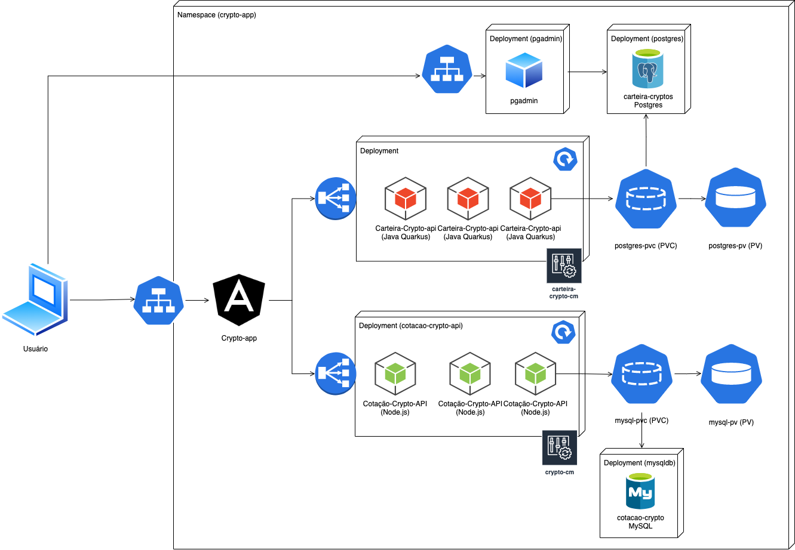

# Containers and Virtualization

## 🎯 Objetivo

Executar em cluster Kubernetes microserviços e frontend em alta disponibilidade. 

## Microserviços / Frontend

1. [Cotacao-crypto-api](https://github.com/AlexDamiao86/trabalho-microservices/tree/main/cotacao-crypto-api) - Microserviço desenvolvido em Node.js com persistência em MySQL. Obtem cotações de criptomoedas por WebSocket API da BitPreço. Disponibiliza CRUD de criptomoedas através de API Rest. É possível interagir com a aplicação através de Swagger pelo endereço "{ip-maquina}:32555/docs".

> **_NOTA:_** Imagem DockerHub: alexdamiao86/cotacao-crypto-api:1.1.0

2. [Carteira-crypto-api](https://github.com/FabioQuimico/carteira-crypto-quarkus) - Microserviço desenvolvido em Quarkus com persistência Postgres. Relaciona as criptomoedas dos clientes. Disponibiliza API Rest para realizar operações CRUD clientes e de operações de compra e venda de criptomoedas. É possível interagir com a aplicação através de Swagger pelo endereço "{ip-maquina}:32080/q/swagger-ui/". 

> **_NOTA:_** Imagem DockerHub: alexdamiao86/carteira-crypto-api:1.0.6

3. [Crypto-app](https://github.com/gabriel2503/Microservices) - Frontend desenvolvido em Angular que consume os dois microserviços anteriores para exibir lista de criptomoedas disponíveis para compra e venda. Registra compra, venda e lista criptomoedas de um cliente. 

> **_NOTA:_** Imagem DockerHub: gabrielobarbosa/crypto:v3

## 📐 Topologia



## ⚙️ Configuração declarativa (Como executar)

> **_NOTA_**: Configuração declarativa .yaml se encontra nas pastas cotação-crypto-api e carteira-crypto-api deste projeto. Código fonte das aplicações nos repositórios de cada um dos projetos. 

A partir de cluster Kubernetes com 1 master e 3 workers em execução. No node master, executar:

1. Componentes do Cotação Crypto:

```bash
git clone https://github.com/AlexDamiao86/containers-kubernetes
```
```bash
cd containers-kubernetes/cotacao-crypto-api 
```
```bash
kubectl create -f manifest.yaml
```

2. Componentes da Carteira Crypto: 

```bash
cd ../carteira-crypto-api
```
```bash
kubectl create -f manifest.yaml
```

3. Componentes da Crypto app: 

```bash
cd ../frontend-crypto-app
```
```bash
kubectl create -f manifest.yaml
```

## 📱 Vídeo demonstrativo da solução

<a href="https://www.loom.com/share/7fbfdd37c34244f6adb17b3e38e69de3">
    <p>Assista aqui</p>
    
  </a>


## 👨🏽‍💻 Desenvolvedores

| [<br><sub>Alexandre Damião Mendonça Maia</sub>](https://github.com/AlexDamiao86) |  [<br><sub>Fabio Ferreira dos Santos</sub>](https://github.com/FabioQuimico) |  [<br><sub>Gabriel Oliveira Barbosa</sub>](https://github.com/Gabriel2503) | [<br><sub>Rafael Braga da Silva Ferreira</sub>](https://github.com/ferreirabraga) | 
| :---: | :---: | :---: | :---: |

>
>Projeto realizado como requisito para conclusão da disciplina Containers e Virtualization do MBA Full Stack Development - FIAP 2022
>
>[Prof. André Pontes Sampaio](https://github.com/tonanuvem)